# Nursely

> AI-powered nurse-facing patient analyst — built for CrimsonCode '26.

Nursely is an Electron desktop app that pulls live patient data from a FHIR server, syncs it to Snowflake, and surfaces a Cortex AI chat assistant and smart analyst columns directly on the nurse's census view.

---

## Features

| Feature             | Description                                                                                                                                                                   |
| ------------------- | ----------------------------------------------------------------------------------------------------------------------------------------------------------------------------- |
| **Live census**     | Fetches up to 50 patients from a SMART-on-FHIR R4 server and displays them in a sortable, filterable table                                                                    |
| **Patient detail**  | Vitals, labs, medications, allergies, and nursing notes pulled per-patient on demand                                                                                          |
| **AI chat**         | Per-patient and unit-wide questions answered by Snowflake Cortex (`mistral-7b`) with full EHR context injected into the prompt                                                |
| **RAG citations**   | Responses are grounded against a 10-doc clinical knowledge base (SEP-1, fall prevention, RRT criteria, etc.) — matching sources expand inline below each answer               |
| **Analyst columns** | Drag-on custom columns (e.g. "Sepsis risk", "Fall risk") that classify every patient via a direct Cortex LLM call and render YES / POSSIBLE / NO badges, sortable high-to-low |
| **Snowflake sync**  | On startup, FHIR bundles are transformed and upserted into structured Snowflake tables; incremental re-syncs run per-patient on demand                                        |

---

## Architecture

### System layers

```mermaid
graph TD
    FHIR["🏥 SMART-on-FHIR R4\nfhirClient.ts"]
    SF["❄️ Snowflake\nsnowflakeClient.ts"]

    subgraph Main["Electron Main Process"]
        FC["fhirClient.ts"]
        FT["fhirTransformer.ts"]
        SO["syncOrchestrator.ts"]
        SC["snowflakeClient.ts"]
        CS["censusService.ts"]
        IPC["IPC handlers\nmain.cjs"]
    end

    subgraph Renderer["React Renderer  (Vite)"]
        App["App.tsx\ncensus · sort · columns"]
        PT["PatientTable.tsx\nvirtualised rows"]
        PD["PatientDetailCard.tsx\nvitals · labs · meds"]
        CP["ChatPanel.tsx\nAI chat · citations"]
        AP["AnalystPanel.tsx\nsmart columns · alerts"]
        CM["chatMock.ts\norchestration"]
        SM["snowflakeMock.ts\nIPC wrappers"]
    end

    subgraph Snowflake["❄️ Snowflake"]
        Tables["Tables\npatients · vitals · labs\nmedications · allergies\nnursing_notes · knowledge_base"]
        NQ["process_nurse_query\nper-patient RAG"]
        CQ["process_cohort_query\nunit-wide RAG"]
        LLM["CORTEX.COMPLETE\nmistral-7b"]
        KB["knowledge_base\nword-match citations"]
    end

    FHIR -->|bundles| FC
    FC --> FT --> SO --> SC
    SC --> IPC
    CS --> IPC
    IPC <-->|contextBridge| CM
    IPC <-->|contextBridge| SM
    CM --> CP
    CM --> AP
    SM --> App
    App --> PT
    App --> PD
    SC -->|SQL| Tables
    IPC -->|CALL| NQ
    IPC -->|CALL| CQ
    IPC -->|COMPLETE| LLM
    NQ --> LLM
    CQ --> LLM
    NQ --> KB
    CQ --> KB
```



### Data flow — AI chat


### Data flow — analyst columns


---

## Local development

```bash
# 1. Install dependencies
npm install

# 2. Configure environment
cp .env.example .env   # fill in Snowflake credentials and FHIR URL

# 3. Deploy Snowflake schema (run once in a Snowflake worksheet)
#    snowflake/setup_all.sql

# 4. Start
npm run electron:dev
```

### Required `.env` keys

```
SNOWFLAKE_ACCOUNT=
SNOWFLAKE_USER=
SNOWFLAKE_PASSWORD=
SNOWFLAKE_WAREHOUSE=
SNOWFLAKE_DATABASE=
SNOWFLAKE_SCHEMA=
FHIR_BASE_URL=https://r4.smarthealthit.org
SYNC_LOOKBACK_HOURS=72
```

---

## Releases

Builds are produced automatically by the [GitHub Actions release workflow](.github/workflows/release.yml).

Push a version tag to trigger a Windows (NSIS installer) and macOS (DMG) build:

```bash
git tag v1.0.1
git push origin v1.0.1
```

Artifacts are attached to the GitHub Release. Required repository secrets: `SNOWFLAKE_ACCOUNT`, `SNOWFLAKE_USERNAME`, `SNOWFLAKE_PASSWORD`, `SNOWFLAKE_DATABASE`, `SNOWFLAKE_SCHEMA`, `SNOWFLAKE_WAREHOUSE`, `SNOWFLAKE_ROLE`.

---

## Snowflake setup

All infrastructure lives in [`snowflake/setup_all.sql`](snowflake/setup_all.sql) — run it top-to-bottom in a Snowflake worksheet to create tables, seed the knowledge base, and deploy both stored procedures.
